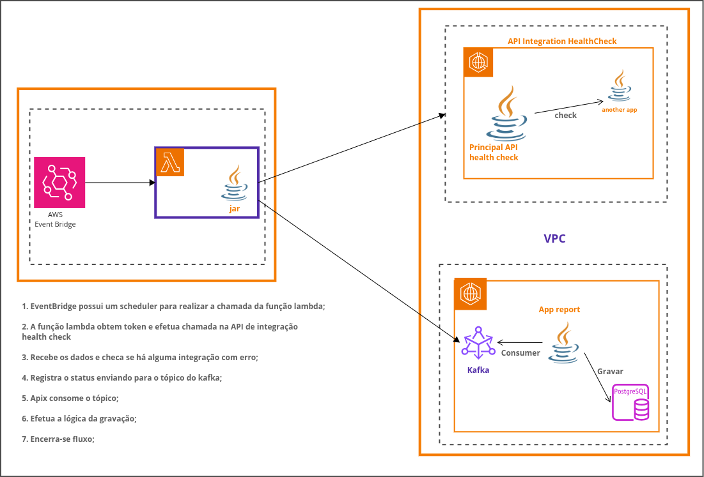

### ✅ Geral
Código de execução para AWS Lambda. O código chama a API de integração healthCheck para monitorar a disponibilidade 
das aplicações a fim de compor o relatório final de disponibilidade da solução.

Este código utiliza Dagger (https://dagger.dev/) para injeção de dependência.

Abaixo, a visão geral da solução:


### 🔠 Variável de Ambiente
O arquivo .env contém as variáveis de ambiente utilizadas na função AWS Lambda.

### 🛠️ Build com Profile Native
Geralmente se recomenda quando o arquivo é maior que 30 MGbyte;

Para gerar usando o profile nativo, execute o seguinte comando:

```bash
mvn clean package -Pnative
```

Isso irá:

- Compilar o código;
- Executar o plugin GraalVM;
- Produzir o binário nativo (veja __target/bootstrap__);

### 🚀 Package como Lambda ZIP

```bash
cd target
zip lambda-native.zip bootstrap
```

E faça o deploy using AWS CLI:

```bash
aws lambda update-function-code \
--function-name healthcheck-monitoring \
--zip-file fileb://target/lambda-native.zip
```

